# AXIS — Real-Time 2-Axis Vision Pan/Tilt Tracker

**Functional engineering MVP.** Host vision in Python / TypeScript, UART protocol, STM32 STEP/DIR firmware, TMC stepper drive.

[Live console](https://axis-vision-pan-tilt.netlify.app) · [GitHub](https://github.com/ahmaddroobi99/axis-vision-pan-tilt)

[](docs/STATUS.md)
[](docs/STATUS.md)
[](LICENSE)
[](host/)
[](docs/uart_protocol.md)

<p align="center">
  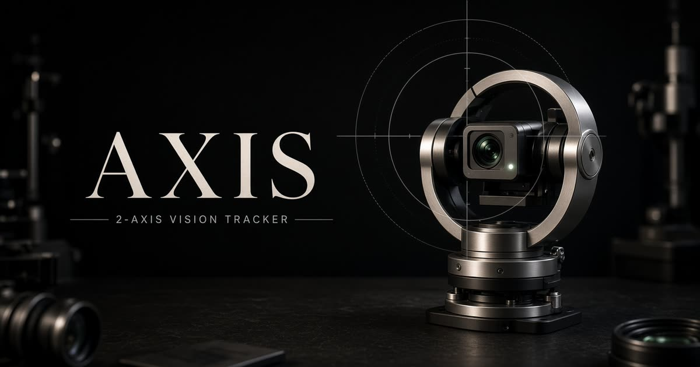
</p>

<p align="center">
  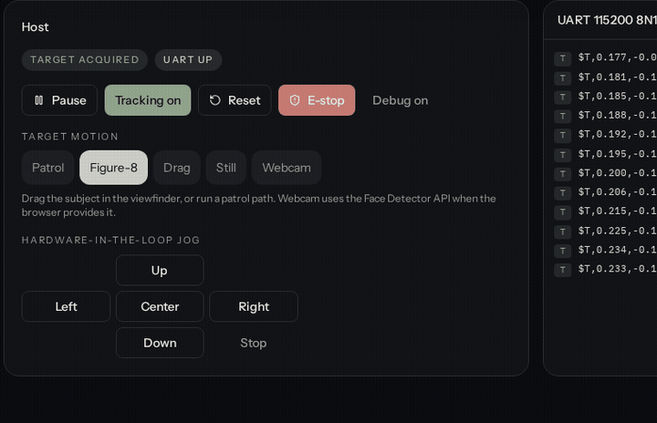
</p>

<p align="center"><em>Closed loop in the interactive console — subject on the reticle, pan/tilt following, UART streaming <code>$T</code> packets. Software loop, not a hardware tracking clip.</em></p>

---

## What this is

A person (or selectable target) moves in front of a USB camera. The host detects the target, computes a **normalized image error** in `[-1, +1]`, and sends it over UART. An STM32 turns that error into **acceleration-limited STEP/DIR** for two TMC-driven steppers. The camera rides the pan/tilt assembly and stays on the subject.

```
USB CAMERA
    │
    ▼
Python / OpenCV          face or synthetic detector
    │
    ├── target center (tx, ty)
    ├── normalize → [-1, +1]
    ├── deadband + exponential filter
    ▼
UART  $T,ex,ey,ts*CS     115200 8N1
    ▼
STM32
    ├── parser + checksum
    ├── PID / P control
    ├── velocity + acceleration limits
    ▼
TMC stepper drivers
    ├──────────────┐
    ▼              ▼
 PAN MOTOR     TILT MOTOR
    └────── CAMERA ┘
```

This repository is an **original reimplementation** of that architecture. It is **not** a copy of any unpublished project. Physical motors, TMC current, and the printed chassis are **not verified** in this tree.

Full drawing set: [docs/diagrams.md](docs/diagrams.md) · [docs/architecture.md](docs/architecture.md)

---

## Live console

Open the [interactive console](https://axis-vision-pan-tilt.netlify.app). Patrol / Figure-8 / Drag / Webcam. Tune gains on **Control**. Parse packets on **UART**.

<p align="center">
  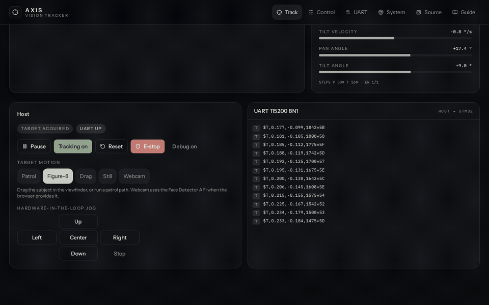
</p>

| Track | Control lab | UART lab |
| --- | --- | --- |
| 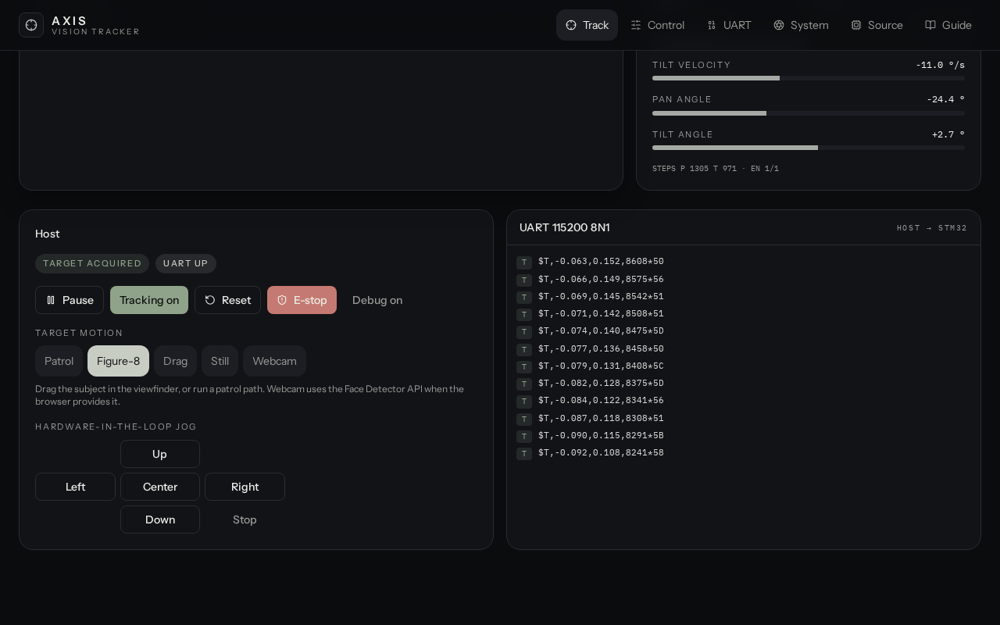 | 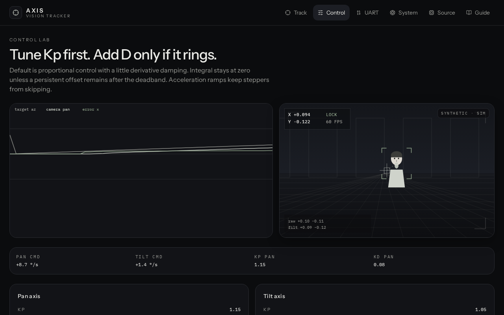 | 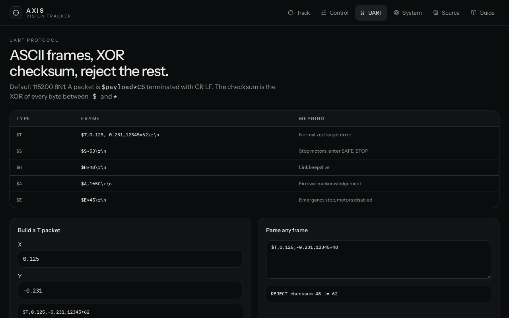 |

| System / wiring | PID scope | Simulated plant |
| --- | --- | --- |
| 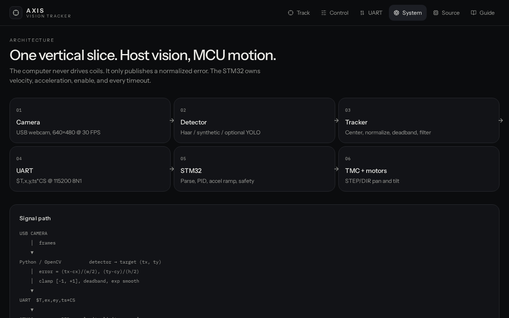 | 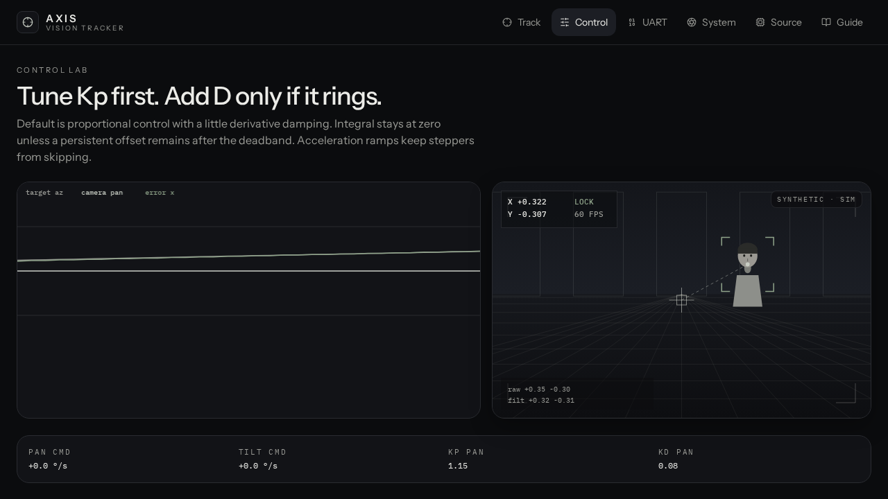 | 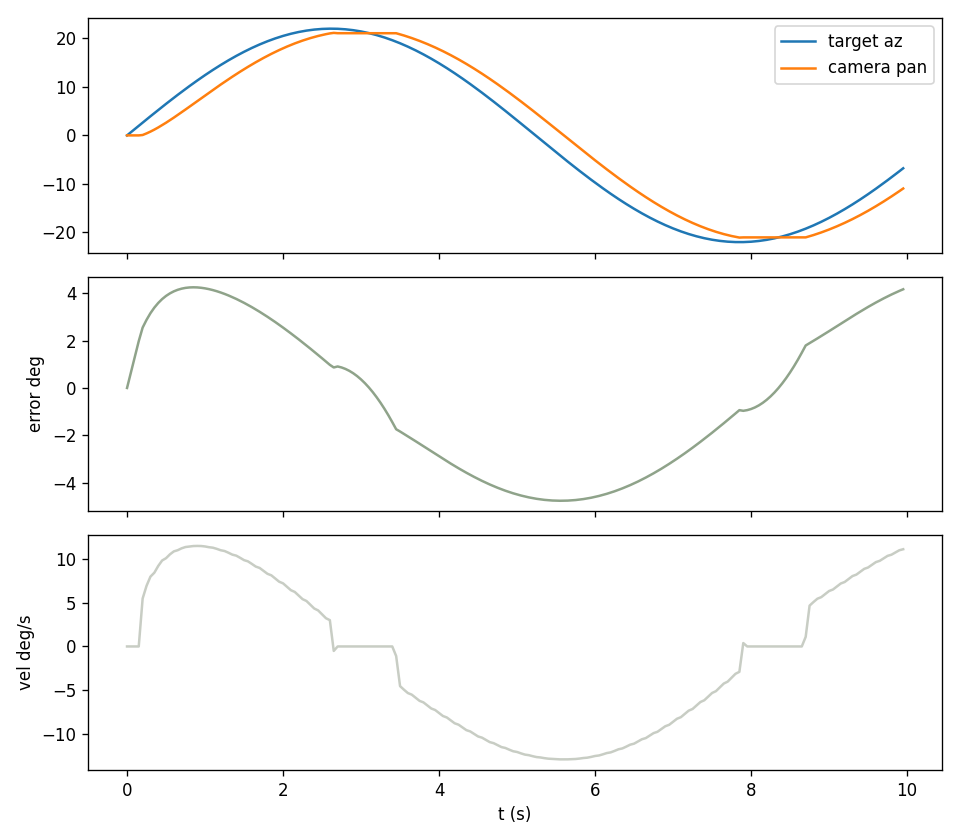 |

The browser console runs the **same control law** as the firmware model: 30 Hz vision, 200 Hz MCU, XOR-framed UART, accel ramps, target-loss and link-loss stop, E-stop.

- **Patrol / Figure-8 / Drag / Webcam** target motion
- Live pan/tilt gimbal, STM32 state, STEP counts
- Packet inspector (`$T` / `$S` / `$H` / `$E`)
- Kp / Ki / Kd, deadband, filter alpha

<p align="center">
  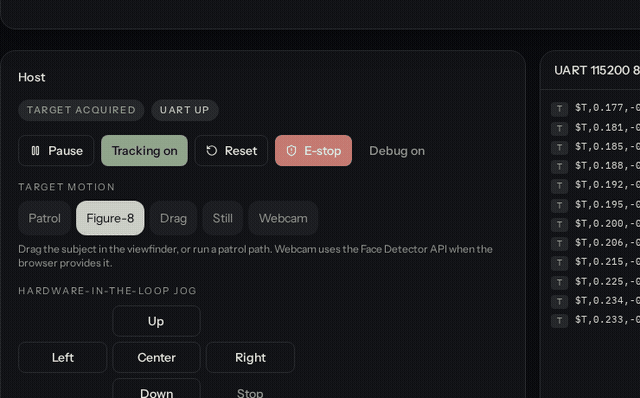
</p>

---

## Features

- USB camera capture with OpenCV Haar face detection (YOLO optional, not required)
- Synthetic detector for hardware-free tests
- Normalized X/Y error, configurable deadband and exponential smoothing
- ASCII UART protocol with XOR checksum and malformed-packet rejection
- Fake-serial and real-serial host modes
- STM32 firmware modules: UART, protocol, PID, motor, safety
- STEP/DIR with velocity and acceleration limits (no step-to-max jump)
- Target timeout and UART timeout → motors stop
- E-stop disables enable
- Interactive simulation and unit tests
- All gains, pins, and timeouts in `config.yaml` / `hardware_config.h`

---

## System architecture

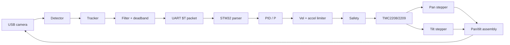

```
┌─────────────────────────────────────────────────────────────────┐
│ HOST (Python / TypeScript)                                      │
│  Camera → Detector → Tracker → Filter → Controller → Serial     │
│                         config.yaml                             │
└──────────────────────────────┬──────────────────────────────────┘
                               │ UART 115200 8N1
                               ▼
┌─────────────────────────────────────────────────────────────────┐
│ STM32                                                           │
│  UART RX → Protocol → PID → Motor ramp → Safety                 │
└──────────────────────────────┬──────────────────────────────────┘
                               │ STEP / DIR / EN
                               ▼
┌─────────────────────────────────────────────────────────────────┐
│ TMC2208/2209  ×2  →  Pan stepper + Tilt stepper                 │
│ Camera is mounted on the tilt platform, which sits on pan.      │
└─────────────────────────────────────────────────────────────────┘
```

### Responsibilities

| Layer | Owns | Does not own |
| --- | --- | --- |
| Host (Python / TS) | Camera, detect, error, filter, packet TX | Coil current, step timing |
| UART | Framing, checksum, ACK/stop/heartbeat | Control law |
| STM32 | Parse, PID, ramps, enable, timeouts | Detection |
| TMC + motors | Microstepped motion | Vision |

### Control loop

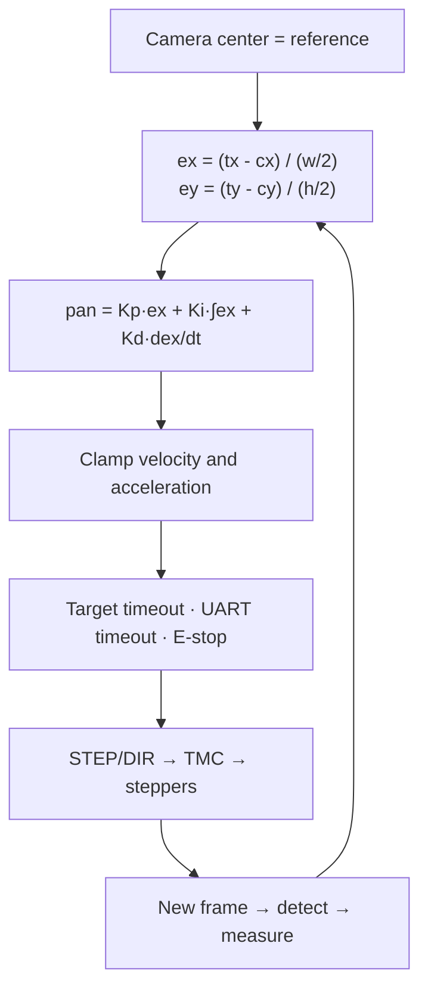

Normalized convention:

- `x < 0` target is **left** of center
- `x > 0` target is **right**
- `y < 0` target is **above**
- `y > 0` target is **below**
- Clamp both to `[-1, +1]`

---

## Sequence (one frame)

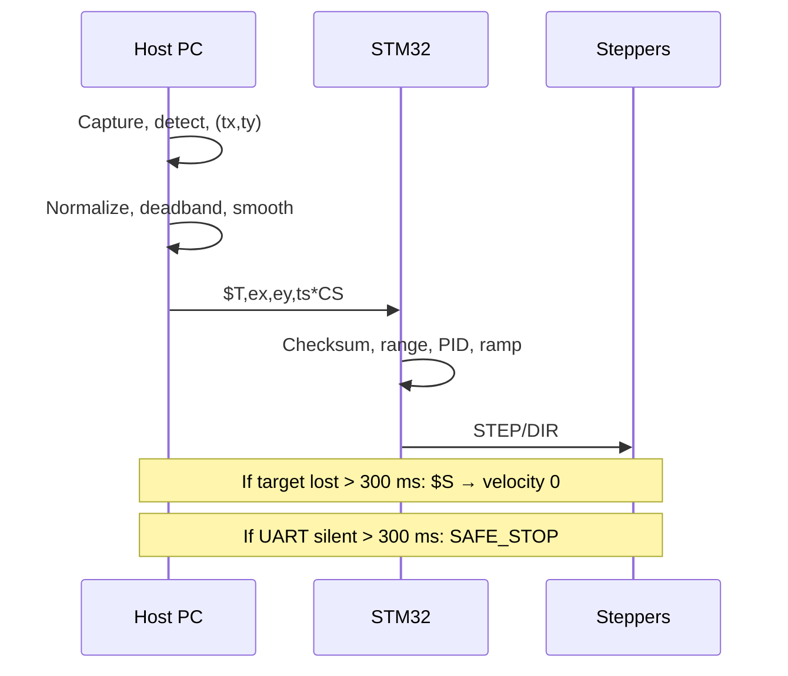

```
Host PC (Python)                         STM32                         Motors
     │                                     │                              │
     │  Capture → detect → (tx, ty)        │                              │
     │  Normalize, deadband, smooth        │                              │
     │  $T,ex,ey,ts*CS  ──────────────────▶│                              │
     │                                     │  checksum, range, PID, ramp  │
     │                                     │  STEP/DIR  ─────────────────▶│
     │                                     │                              │
     │  If target lost > 300 ms: $S  ─────▶│  velocity → 0                │
     │  If UART silent > 300 ms            │  SAFE_STOP                   │
```

---

## Firmware state machine

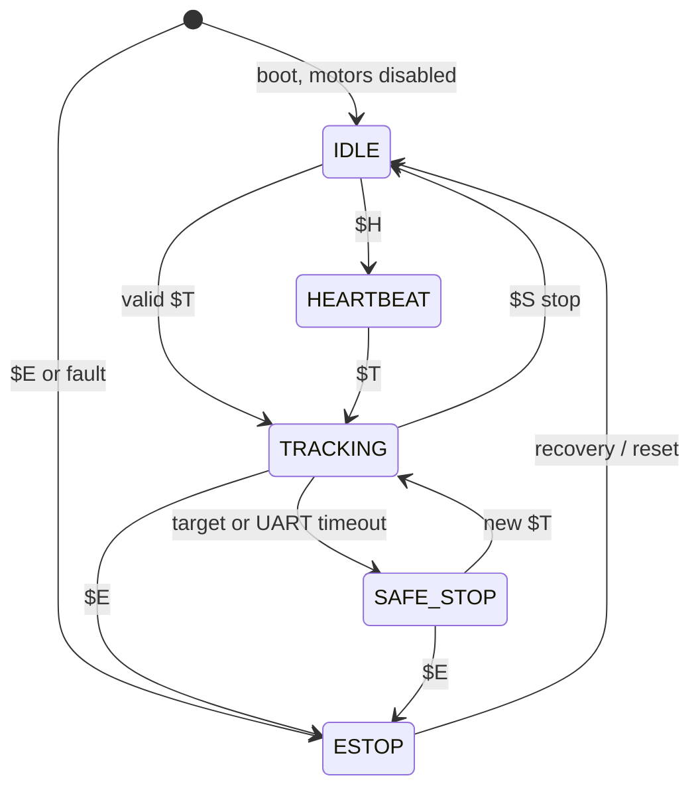

| Transition | Condition |
| --- | --- |
| IDLE → TRACKING | Valid `$T` packet |
| TRACKING → IDLE | `$S` stop |
| TRACKING → SAFE_STOP | Target timeout or UART timeout |
| SAFE_STOP → TRACKING | New valid `$T` |
| ANY → ESTOP | `$E` or hardware fault |
| ESTOP → IDLE | Explicit recovery / reset |

Motors start **disabled**. A malformed packet is ignored. Communication loss never leaves the axes running.

---

## Hardware

Assumed bench:

- STM32 development board (pins in `firmware/config/hardware_config.h`)
- 2× stepper motors + 2× TMC2208/2209 (STEP/DIR)
- USB webcam on the tilt platform
- USB–UART adapter, **common ground**
- 3.3 V logic supply, separate 12–24 V motor supply

<p align="center">
  
</p>

```
USB webcam ──USB──▶ Host PC ──USB-UART──▶ STM32
                                           │
                    PA0 STEP  PA1 DIR  PA2 EN ──▶ TMC pan  ──▶ pan stepper
                    PA3 STEP  PA4 DIR  PA5 EN ──▶ TMC tilt ──▶ tilt stepper
                    PA9 TX / PA10 RX / GND common
                    3.3 V logic     12–24 V motor VM (separate)
```

### Wiring

| Signal | STM32 (default) | Driver / host |
| --- | --- | --- |
| PAN STEP | PA0 | TMC pan STEP |
| PAN DIR | PA1 | TMC pan DIR |
| PAN ENABLE | PA2 | TMC pan EN (idle disabled) |
| TILT STEP | PA3 | TMC tilt STEP |
| TILT DIR | PA4 | TMC tilt DIR |
| TILT ENABLE | PA5 | TMC tilt EN |
| USART TX | PA9 | Host RX |
| USART RX | PA10 | Host TX |
| GND | GND | **Common ground required** |

Logic 3.3 V only. Motor VM is 12–24 V on its own supply. Tie grounds. Enable is inactive at boot. Details: [docs/wiring.md](docs/wiring.md)

---

## UART protocol

ASCII, 115200 8N1. Frame: `$payload*CS\r\n`. Checksum is XOR of every byte between `$` and `*`, two uppercase hex digits.

```
$ T ,  x  ,  y  ,  timestamp  *  CS  \r\n
│         payload (XOR)          │
example: $T,0.125,-0.231,12345*62
```

| Type | Example | Meaning |
| --- | --- | --- |
| Target | `$T,0.125,-0.231,12345*62` | Normalized error |
| Stop | `$S*53` | Ramp velocity to 0 |
| Heartbeat | `$H*48` | Link keepalive |
| ACK | `$A,1*14` | Firmware acknowledgement |
| E-stop | `$E*45` | Immediate disable |

Parser rejects missing frame, bad checksum, non-numeric fields, and values outside `[-1, 1]`. Full spec: [docs/uart_protocol.md](docs/uart_protocol.md)

---

## Repository layout

```
axis-vision-pan-tilt/
├── README.md
├── LICENSE
├── config.yaml
├── requirements.txt
├── docs/                  architecture, wiring, protocol, diagrams, tuning, status, media
├── host/                  Python vision + UART
├── firmware/              STM32 C modules + host-testable parser
├── simulation/            plant + controller without hardware
├── tests/                 protocol, tracker, controller, safety
├── tools/                 packet_test, calibrate
└── src/                   Interactive TypeScript console (this app)
```

---

## Run

### Interactive console (this app)

```bash
npm install
npm run dev
```

Open the preview. Use Patrol / Figure-8 / Drag. Tune gains on **Control**. Parse packets on **UART**.

### Python host (no GPU required)

```bash
python3 -m venv .venv
source .venv/bin/activate
pip install -r requirements.txt
python3 -m host.main --simulation
python3 -m host.main --synthetic
python3 simulation/tracker_sim.py
python3 tools/packet_test.py
python3 -m pytest -q
```

Haar cascade is OpenCV’s built-in frontal-face detector. YOLO is optional and not required.

### Firmware parser check (no ARM toolchain required)

```bash
gcc -O1 -Wall -Wextra -o /tmp/protocol_host firmware/App/protocol_host.c
/tmp/protocol_host
```

STM32CubeIDE / `arm-none-eabi-gcc` is the path to a device binary. Pins stay in `hardware_config.h`.

---

## Configuration

Do not scatter gains through the source. Edit [`config.yaml`](config.yaml):

```yaml
camera: { index: 0, width: 640, height: 480, fps: 30 }
detector: { type: haar, confidence: 0.5 }
tracking: { filter_alpha: 0.25, deadband: 0.05, target_timeout_ms: 300 }
uart: { port: /dev/ttyACM0, baudrate: 115200, timeout: 0.1 }
pan:  { kp: 1.15, ki: 0.0, kd: 0.08, max_speed: 70, acceleration: 220 }
tilt: { kp: 1.05, ki: 0.0, kd: 0.10, max_speed: 50, acceleration: 180 }
```

---

## Tuning

Start with **Ki = 0, Kd = 0**. Raise **Kp** until the camera keeps a walking subject in frame. If it overshoots or rings, drop Kp and add a little **Kd**. Only add **Ki** if a real steady-state offset remains after the deadband.

<p align="center">
  
</p>

<p align="center"><em>Software plant: error, command, and pan/tilt after a step. Not a hardware scope capture.</em></p>

| Symptom | Likely cause | First move |
| --- | --- | --- |
| Jitter | Detection noise | Lower alpha, raise deadband |
| Overshoot | Kp too high | Drop Kp, add Kd |
| Sluggish | Gain / speed too low | Raise Kp or max speed |
| Missed steps | Accel / current / mechanics | Lower acceleration, check TMC current |
| Backlash | Mechanical | Fix the gearbox, not the PID |

Guide: [docs/tuning.md](docs/tuning.md)

---

## Safety

- Boot: motors disabled, wait for a valid command
- Target lost > `target_timeout_ms` → stop
- UART silent > timeout → stop
- Bad packet → ignore (never command)
- E-stop → enable off
- Velocity and acceleration always clamped
- Keep a hardware switch in series with motor supply on anything larger than a desktop gimbal

---

## Status

| Item | Result |
| --- | --- |
| Vision math, filter, deadband | Software verified |
| UART encode / parse / checksum | Software verified |
| PID + anti-windup | Software verified |
| Motor accel ramp | Software verified |
| Target-loss / UART-loss / E-stop | Software verified |
| Interactive closed-loop console | Software verified |
| STM32 on a development board | **Not physically verified** |
| TMC current / microstepping | **Not physically verified** |
| Person-following on hardware | **Not tested** |

Honest log: [docs/STATUS.md](docs/STATUS.md)

---

## Next bench steps

1. Logic power only. Motors unpowered. EN inactive.
2. 115200 UART. Send `$H`, confirm the parser.
3. Jog left / right / up / down / center / stop. Fix DIR if an axis is inverted.
4. Power motors at a conservative current. Repeat jog.
5. Raise Kp from ~0.4 until a walking subject stays in frame.

---

## License

MIT. Original implementation. Do not treat this as a drop-in clone of any unpublished repository.
